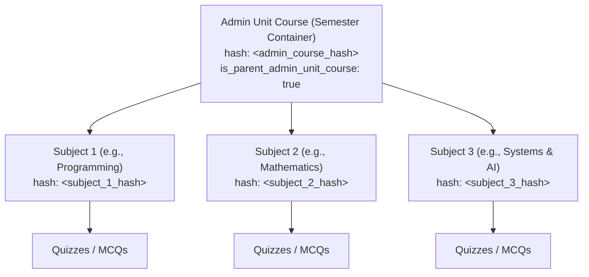
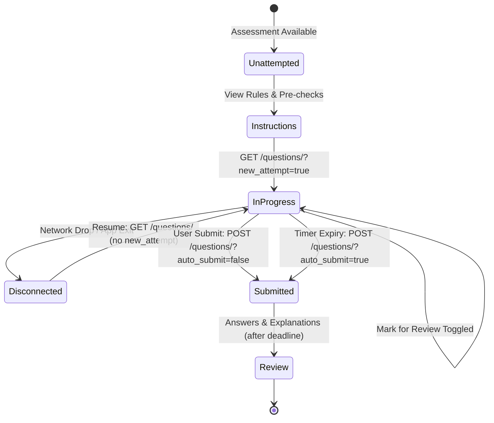

# Newton School LMS: Quizzes & Assessments Subsystem Specification

A complete, in-depth architectural and API specification for the **Quizzes & Assessments Subsystem** of Newton School LMS (`my.newtonschool.co`). This documentation covers the entire lifecycle—from cohort-wide course aggregation and pre-checks to real-time option synchronization, network recovery, automatic submission, and post-deadline solution retrieval.

All identifiers, course IDs, hashes, and student credentials are fully generalized with semantic placeholders (`<auth_token>`, `<admin_course_hash>`, `<assessment_hash>`, etc.) for building standalone terminal (CLI/TUI) applications.

---

## 1. Subsystem Architecture & Course Scoping

Newton School arranges courses hierarchically. An **Admin Unit Course** (`is_parent_admin_unit_course: true`) represents an entire cohort/semester container that encompasses multiple child **Learning Unit Courses** (individual academic subjects like Programming, Systems, Mathematics).



### 1.1 Course Hash Aggregation Rules
1. **Querying via `<admin_course_hash>`**:
   When querying the assessment list using an Admin Course Hash, the backend automatically **aggregates assessments across all enrolled subjects** in that semester. Each result item contains a populated `course` object describing the specific subject it belongs to:
   ```json
   "course": {
     "hash": "<subject_1_hash>",
     "title": "<subject_1_title>",
     "short_display_name": "<subject_1_short_name>"
   }
   ```
2. **Filtering by Subject within an Admin Course**:
   To retrieve assessments for only one subject under the semester container, append `&learning_course_hash=<subject_course_hash>`.
3. **Querying via `<subject_course_hash>` Directly**:
   When passing a Subject Course Hash directly as the URL parameter, results are strictly limited to that subject, and no cross-subject aggregation occurs.

---

## 2. Assessment Discovery & Listing API

### 2.1 Endpoint
```http
GET /api/v2/course/h/{courseHash}/assessment/all/
Authorization: Bearer <auth_token>
Accept: application/json
```

### 2.2 Query Parameters

| Parameter | Type | Required | Description |
| :--- | :--- | :---: | :--- |
| `limit` | integer | Optional | Page size (default: `10`). |
| `offset` | integer | Optional | Pagination offset (default: `0`). |
| `attempt_statuses` | string | Optional | Comma-separated attempt filter:<br>• `1`: **Not Attempted** (never started)<br>• `2`: **Attempted** (in progress / unfinished)<br>• `3`: **Completed** (submitted) |
| `sub_types` | string | Optional | Subtype filter:<br>• `4`: Module Contest (`is_module_contest=true`)<br>• `5`: Placement Contest (`is_placement_contest=true`) |
| `topic_pool_hash` | string | Optional | Scopes assessments to a specific Module / Topic Pool UUID. |
| `filter_topic_slugs` | string | Optional | Comma-separated syllabus topic slugs. |
| `learning_course_hash`| string | Optional | Filters by a specific child subject under an admin course. |
| `is_contest` | boolean | Optional | When `true`, filters contest assessments. |

### 2.3 Supporting Dropdown Endpoints
To populate filter menus in a terminal interface:
- **Available Subjects**: `GET /api/v2/course/h/{adminCourseHash}/learning_course/all/?pagination=false`
- **Modules / Syllabus Units**: `GET /api/v2/course/h/{courseHash}/module/list/?is_contest=false&offset=0&limit=100`
- **Topic Tags**: `GET /api/v2/course/h/{courseHash}/assessment/topic/all/?is_contest=false&offset=0&limit=50`

### 2.4 Response Schema
```json
{
  "count": 22,
  "next": "/api/v2/course/h/<admin_course_hash>/assessment/all/?attempt_statuses=&limit=10&offset=10",
  "previous": null,
  "performance": {
    "completed_assessment_count": 7,
    "total_assessment_count": 22
  },
  "results": [
    {
      "hash": "<assessment_hash>",
      "course": {
        "hash": "<subject_course_hash>",
        "title": "<subject_title>",
        "short_display_name": "<subject_short_name>"
      },
      "title": "<quiz_title>",
      "start_timestamp": "2026-09-24T15:05:03.083766+05:30",
      "end_timestamp": "2026-09-29T15:05:03.083766+05:30",
      "earnable_xp": {
        "is_xp_enabled": true,
        "earnable_points": 48,
        "earned_points": 48,
        "deadline": "2026-09-29T09:35:03.083766Z"
      },
      "topics": ["Algorithms", "Complexity"],
      "has_integrated_assessment_mapping": false,
      "course_user_assessment_mapping": {
        "attempt": 1,
        "completed": true,
        "late_completed": false,
        "marks": 10,
        "marks_during_contest": 0,
        "solved_question_count": 10,
        "total_question_count": 10,
        "started_at": 1789642553000,
        "completed_at": 1789671017000,
        "end_timestamp": 1790073300000
      }
    }
  ]
}
```
> [!NOTE]
> If a student has never clicked "Start" on an assessment, `course_user_assessment_mapping` is `null`.

---

## 3. Attempt Lifecycle & State Machine



### 3.1 Pre-Checks & Instructions
Before attempting a quiz, the client inspects constraints and rules.

```http
GET /api/v1/course/h/{courseHash}/assessment/h/{assessmentHash}/instructions/
Authorization: Bearer <auth_token>
```

#### Pre-Check Rules:
1. **Timing Window**:
   - `start_timestamp > Date.now()`: Upcoming quiz. Show countdown timer.
   - `end_timestamp < Date.now()`: Expired/Closed quiz. Redirect immediately to view results/solutions.
2. **Proctoring Requirements**:
   - `is_proctored_exam`: If `true`, requires camera/microphone proctoring permissions (`required_proctoring_permissions: [2, 3, 4]`).
   - `can_attempt_through_device`: Array of allowed device identifiers (`[1]` = Standard Web Browser).
3. **Honor Code Acknowledgment**:
   - If `honor_code != null` and `has_acknowledged_honor_code == false`, the client must dispatch:
     ```http
     POST /api/v1/integrated_assessments/{courseHash}/h/{assessmentHash}/honor_code/
     ```
4. **Already Started Exceptions (Error Codes)**:
   - If an attempt is already active or finished, the instructions endpoint returns `400 Bad Request`:
     ```json
     {
       "error_code": "E179",
       "message": "you have already started assessment"
     }
     ```
   - When receiving `E179`, `E221`, or `E1081`, the client skips the instruction screen and enters the quiz question session directly.

#### Instructions Response Schema:
```json
{
  "hash": "<assessment_hash>",
  "title": "<quiz_title>",
  "sub_title": "",
  "instructions": [
    "You have a single attempt for this assessment.",
    "Once submitted, answers cannot be edited.",
    "Do not switch tabs during a timed quiz."
  ],
  "start_timestamp": 1790339400000,
  "end_timestamp": 1790944200000,
  "duration": null,
  "assessment_type": 1,
  "was_competitive": false,
  "is_proctored_exam": false,
  "total_questions": 10,
  "max_marks": 20,
  "max_attempts": 1,
  "clearing_marks": 0,
  "honor_code": null,
  "has_acknowledged_honor_code": false
}
```

---

## 4. Starting, Resuming & Session Recovery

### 4.1 Starting a New Attempt
When the student confirms "Start Test":
```http
GET /api/v1/course/h/{courseHash}/assessment/h/{assessmentHash}/questions/?new_attempt=true
Authorization: Bearer <auth_token>
```
- Creates a new attempt record on the server.
- Establishes `course_user_assessment_mapping_hash` and starts the countdown timer to `end_timestamp`.

### 4.2 Resuming an Existing Attempt (Disconnection Recovery)
If the user's internet drops, browser refreshes, or the terminal process is closed:
```http
GET /api/v1/course/h/{courseHash}/assessment/h/{assessmentHash}/questions/
Authorization: Bearer <auth_token>
```
*(Notice `new_attempt=true` is **omitted**).*

#### What is Stored & Recovered:
The server maintains state centrally in its database:
- **`end_timestamp`**: Remains fixed. The time continues elapsing on the server regardless of whether the client is online.
- **`marked_choice`**: All previously chosen options are restored.
- **`input_puzzle_answer`**: All typed inputs are preserved.
- **`marked_for_review`**: True/false review flags remain intact.
- **`viewed_at`**: Last viewed timestamp per question is preserved.

---

## 5. Question Data Models & Interaction APIs

### 5.1 Question Types Enum
The platform defines questions under four fundamental types:
```json
{
  "MCQ": 1,
  "PUZZLE": 2,
  "FILL_IN_THE_BLANKS": 3,
  "MATCH_THE_COLUMNS": 4
}
```

### 5.2 Question Object Schema (from `questions[]` array)
```json
{
  "hash": "<question_response_mapping_hash>",
  "multiple_choice_question": {
    "hash": "<mcq_internal_hash>",
    "question_text": "<p>What is the time complexity of binary search?</p>",
    "question_type": 1,
    "choice_A_text": "<span>O(N)</span>",
    "choice_A_image": null,
    "choice_B_text": "<span>O(log N)</span>",
    "choice_B_image": null,
    "choice_C_text": "<span>O(N log N)</span>",
    "choice_C_image": null,
    "choice_D_text": "<span>O(1)</span>",
    "choice_D_image": null,
    "choice_E_text": "",
    "choice_E_image": null,
    "marks": 2,
    "shuffle_options": false
  },
  "marked_choice": 2,
  "input_puzzle_answer": null,
  "input_answer": null,
  "marked_for_review": false,
  "viewed_at": "2026-09-26T10:00:00.000000+05:30",
  "earnable_points": {
    "earned_points": 0,
    "earnable_points": 2,
    "earned_at": null
  }
}
```

> [!IMPORTANT]
> - In `questions[]`, `marked_choice` is returned as a **1-based integer** (`1` = A, `2` = B, `3` = C, `4` = D, `5` = E).
> - When transmitting updates via the action endpoint, `value` is sent as the **capital letter character** (`"A"`, `"B"`, `"C"`, `"D"`).

---

### 5.3 Real-time Option Marking & Action Endpoint
All question mutations (selecting, clearing, typing, flagging) use a single endpoint:

```http
POST /api/v1/course/h/{courseHash}/assessment/h/{assessmentHash}/question/
Authorization: Bearer <auth_token>
Content-Type: application/json
```

#### A. Selecting an Option (MCQ Type 1)
Dispatched immediately when an option is selected:
```json
{
  "hash": "<question_response_mapping_hash>",
  "value": "B",
  "client_marked_at": 1790409500000
}
```

#### B. Clearing / Deselecting an Option
If the user clicks the currently selected option to unselect it:
```json
{
  "hash": "<question_response_mapping_hash>",
  "value": "",
  "client_marked_at": 1790409500000
}
```

#### C. Submitting Numerical / Puzzle Answer (Type 2 & 3)
For text inputs or integer puzzle answers:
```json
{
  "hash": "<question_response_mapping_hash>",
  "value": "42",
  "client_marked_at": 1790409500000
}
```

#### D. Toggling "Mark for Review"
Used by students to flag a question to revisit before submitting:
- **Flag for review**:
  ```json
  {
    "hash": "<question_response_mapping_hash>",
    "marked_for_review": "1"
  }
  ```
- **Unflag review**:
  ```json
  {
    "hash": "<question_response_mapping_hash>",
    "marked_for_review": "0"
  }
  ```

#### E. Recording "Viewed" State
When a question is rendered on screen:
```json
{
  "hash": "<question_response_mapping_hash>"
}
```
*(Server updates `viewed_at = now()` to track student question progression).*

---

## 6. Final Submission & Auto-Submit Pipeline

### 6.1 Finalize Attempt Endpoint
```http
POST /api/v1/course/h/{courseHash}/assessment/h/{assessmentHash}/questions/?auto_submit={autoSubmit}
Authorization: Bearer <auth_token>
Content-Type: application/json
```

#### Query Parameter:
- `auto_submit=false`: Manual student submission (clicking "Submit Quiz" and confirming the modal).
- `auto_submit=true`: Automatic submission triggered when the countdown timer reaches zero.

**Request Payload**:
```json
{}
```
*(For modular / multi-section assessments, includes `{"section_hash": "<assessment_hash>", "section_type": 2}`)*

**Response**:
Returns the updated assessment object with `"completed": true` and calculated `marks`.

### 6.2 Submission Fault Tolerance:
If a network timeout occurs during `auto_submit=true` (e.g. socket closure right as timer ends), the client immediately sends `GET .../questions/` without params. If the backend's server-side background worker has already auto-closed the assessment, it returns `"completed": true`, confirming successful submission.

---

## 7. Post-Assessment Evaluation & Solution Retrieval

### 7.1 Time-Gated Solution Restriction (Contest Rules)
The Newton School backend enforces a strict rule:
- **`Date.now() < end_timestamp`**: If the assessment window has not closed for the entire cohort, the server **omits** correct answers and explanations from the response, even if the student has already submitted. The client renders:
  > *"Answers available on `<end_timestamp>`. You will be able to see the answers after the deadline of the quiz."*
- **`Date.now() >= end_timestamp`**: Once the collective cohort deadline passes, full solutions and answer keys become available.

### 7.2 Fetching Detailed Answers & Explanations
Once completed and past the deadline, calling `GET .../questions/` returns the complete evaluation:

```http
GET /api/v1/course/h/{courseHash}/assessment/h/{assessmentHash}/questions/
Authorization: Bearer <auth_token>
```

#### Evaluation Schema per Question:
```json
{
  "hash": "<question_response_mapping_hash>",
  "multiple_choice_question": {
    "hash": "<mcq_hash>",
    "question_text": "<p>What is the time complexity of binary search?</p>",
    "question_type": 1,
    "marks": 2,
    "correct_choice": 2,
    "correct_choice_explanation": "<p>Binary search halves the search space at each step, yielding O(log N).</p>",
    "correct_puzzle_answer": null
  },
  "marked_choice": 2,
  "input_puzzle_answer": null,
  "marked_for_review": false,
  "earnable_points": {
    "earned_points": 2,
    "earnable_points": 2,
    "earned_at": "2026-09-26T10:15:00Z"
  }
}
```

#### Question Evaluation Logic:
In the client interface, question correctness is calculated using:
```javascript
function evaluateQuestionStatus(question) {
  const { marked_choice, multiple_choice_question } = question;
  const correctChoice = multiple_choice_question.correct_choice;

  if (marked_choice === null || marked_choice === undefined) {
    return 'UNATTEMPTED';
  }
  if (marked_choice === correctChoice) {
    return 'CORRECT';
  }
  return 'INCORRECT';
}
```

### 7.3 Quiz XP & Experience Points
To fetch the gamification points awarded for a quiz:
```http
GET /api/v2/course/h/{courseHash}/experience_points/assessment/{assessmentHash}/
Authorization: Bearer <auth_token>
```

**Response**:
```json
{
  "is_xp_enabled": true,
  "earned_points": 20,
  "earnable_points": 20,
  "deadline": "2026-09-29T09:35:03Z",
  "earned_at": "2026-09-26T10:15:00Z"
}
```

### 7.4 Formal Test Results Summary
For proctored or graded exams:
```http
GET /api/v1/course/h/{courseHash}/assessment/h/{assessmentHash}/student-results
Authorization: Bearer <auth_token>
```
**Key Fields**:
- `percentage_obtained`: Floating point percentage score.
- `is_passed`: Boolean pass/fail against `clearing_marks`.
- `solved_question_count` vs `total_question_count`.

---

## 8. Terminal Client (CLI / TUI) Implementation Blueprint

When implementing a quiz solver/attempt module in a terminal client (e.g. Go Bubbletea or Python Textual), follow this architectural pattern:

### 8.1 State Machine
```text
  [1. Assessment Selector] ──▶ Shows quizzes aggregated from <admin_course_hash>
           │
           ▼
  [2. Instructions View]   ──▶ Verifies timing & honor code; catches E179 to resume
           │
           ▼
  [3. Active Quiz TUI]
       ├── Question Navigator Palette (1 .. N) with visual color tags:
       │     • Grey: Not visited
       │     • Blue: Viewed / Unanswered
       │     • Green: Answered
       │     • Yellow: Marked for Review
       ├── Countdown Timer: (end_timestamp - now()) in top status bar
       ├── Keybindings:
       │     • [1]-[5] or [A]-[E]: Toggle option
       │     • [R]: Toggle Mark for Review
       │     • [C]: Clear selection
       │     • [N] / [P]: Next / Previous question
       │     • [S]: Confirm and submit quiz
       └── Auto-Submit worker triggers on timer expiration
           │
           ▼
  [4. Review Screen]       ──▶ Summarizes score, marks obtained, and solution breakdown
```

### 8.2 Safe Option Dispatch Pattern
Because network calls in a terminal can fail or be interrupted, maintain an optimistic local cache:
1. Update local state immediately on keypress so the UI feels instantaneous (0ms latency).
2. Dispatch `POST .../question/` in an asynchronous background goroutine / task.
3. Queue requests sequentially to guarantee in-order delivery to the server.
4. If the client abruptly crashes or is terminated (`Ctrl+C`), relaunching simply calls `GET .../questions/` to restore the identical session without data loss.
